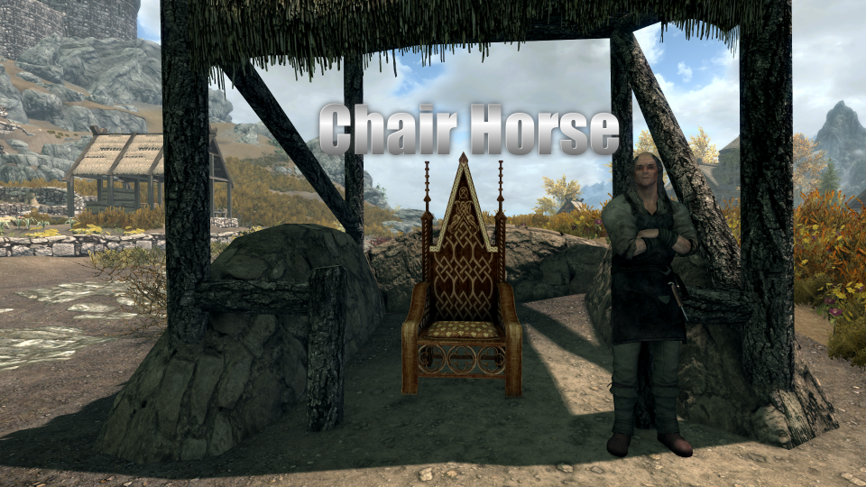

# Chair Horse

A Skyrim Special Edition mod By Mark E. Kraus.

My mods:

* [Barstool Brawler](https://www.nexusmods.com/skyrimspecialedition/mods/61354)
* [Chairhammers - Chair Warhammers](https://www.nexusmods.com/skyrimspecialedition/mods/61304)
* [Chair Horse]({NEWURL})
* [Chairrows - Chair Arrows](https://www.nexusmods.com/skyrimspecialedition/mods/61168)
* [Cheat Jewelry](https://www.nexusmods.com/skyrimspecialedition/mods/58973)
* [Cheat Powers](https://www.nexusmods.com/skyrimspecialedition/mods/58892)
* [Exit Combat Power](https://www.nexusmods.com/skyrimspecialedition/mods/58651)
* [Greatchairs - Chair Greatswords](https://www.nexusmods.com/skyrimspecialedition/mods/62526)
* [Sentient Chairs of Skyrim (SCOS)](https://www.nexusmods.com/skyrimspecialedition/mods/59604)
* [Summon Corpses](https://www.nexusmods.com/skyrimspecialedition/mods/62857)

## About Chair Horse

Adds a Chair Horse to Skyrim.

Normal horses are still available.

## Features

### The Chair Horse

The Chair Horse is a chair that you can ride around the world of Skyrim like a horse. The stats for the Chair Horse are as follows.

* Level: 50
* Stamina: 298
* Health: 1637
* Essential: Yes (The Chair Horse will never die)

Because the Chair Horse is made of wood, it does not bleed, is immune to diseases and poisons, and is weak to fire damage.

### Herman Miller Stables

Herman Miller is the only hostler in Skyrim that sells Chair Horses. His stables can be found outside of Whiterun near the Battle-Born Farm.

You can purchase the Chair Horse for the same price as a normal horse (1,000 Gold). Herman includes a "Summon Chair Horse" spell with your purchase.

If you talk to Herman Miller after purchasing your Chair Horse, he can also teach you the "Change Chair Horse Style" spell for free. If that's not spicy enough for you, he will offer to sell you a "Ring of Chair Horse Changing" for 15,000 Gold.

### 27 Chair Horse Styles

The Chair Horse has 27 different styles of chairs and thrones. The style can be changed with the "Change Chair Horse Style" style spell or the "Ring of Chair Horse Changing" (both available from Herman Miller).

### Chair Horse Spells

Herman Miller can teach the following spells:

* Summon Chair Horse - Summons your chair horse to the targeted location. You will learn this spell immediately when you purchase the Chair Horse.
* Change Chair Horse Style - Changes the chair horse style, rotating from a list of 27 possible styles. Talk to Herman Miller after you purchase the Chair Horse to learn this spell for free.

### Ring of Chair Horse Changing

The "Ring of Chair Horse Changing" is sold by Herman Miller for 15,000 Gold after he teaches you the "Change Chair Horse Style" spell. While wearing the ring, the style of your chair horse will change every 15 seconds. This even works while you are riding your Chair Horse.

## Installation

### Requirements

This mod has no requirements.

### NMM/Vortex/MO2

Download and install with the mod manager of your choice and the FOMOD installer will take care of the rest.

### Manual

* Extract the Zip file.
* Copy the extracted `MarkekrausChairHorse.esp` and `MarkekrausChairHorse.bsa` files to the `data` folder under your Skyrim: Special Edition installation folder.
* Enable the plugin using whatever method you usually use.

### Load Order

This mod can be installed in any order.

## Compatibility

This mod is not compatible with Sentient Chairs of Skyrim.

This mod has not been tested with any mods that change the behavior of horses. It is possible this mod is not compatible with mods like Convenient Horses.

## Not Lore-Friendly

This mod is silly and not lore-friendly.
